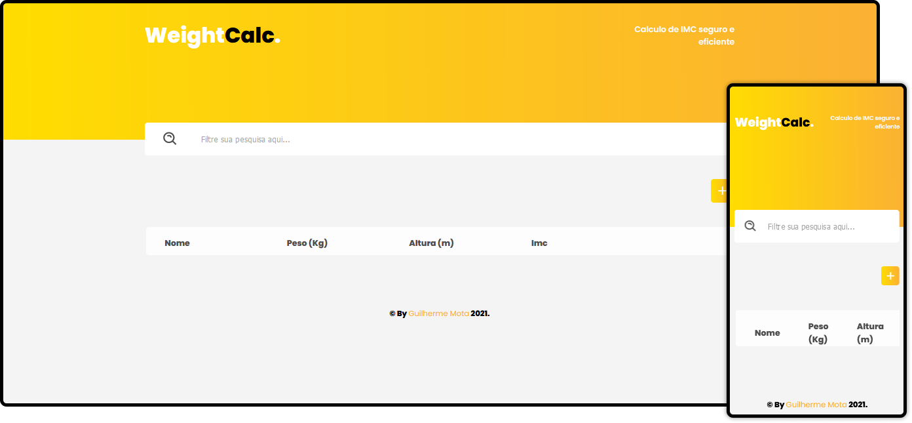

<h1 align="center">
    <strong>WEIGHT<strong style="color: #000">CALC</strong>.
</h1>

 

  

## 🚀 Tecnologias

Esse projeto foi desenvolvido com as seguintes tecnologias:

- HTML5
- CSS3
- JavaScript

## 💻 Projeto

O WeightCalc é uma plataforma de calculos de IMC, com um layout clean de cadastro de pacientes.

## 🔖 Layout

100% autoral.

 

---

## Licença

Esse projeto está sob a licença MIT. Veja o arquivo [LICENSE](LICENSE.md) para mais detalhes.
